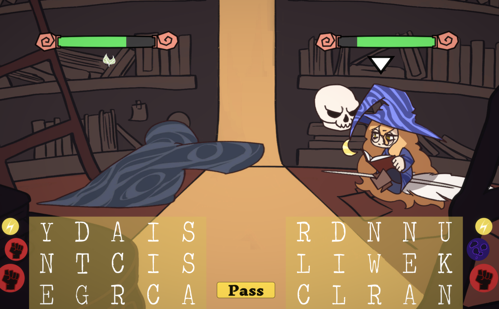

# LinguaLitis

Lingus Litis is a 2 player fighting game created with Unity.

Approximate play time: 5-10 minutes, or more if multiple rounds are played.

Unity Version: 2020.3.12f1

## How to play
You can download the latest release of the game at https://poshon.itch.io/lingua-litis (password: magic). The game is played with keyboard input and/or mouse input.

Each player spells words to cast magical spells at the opposing player. The words must be created using letters from one's own letter bank. The effectiveness
of the word increases as the complexity of the word increases. 
